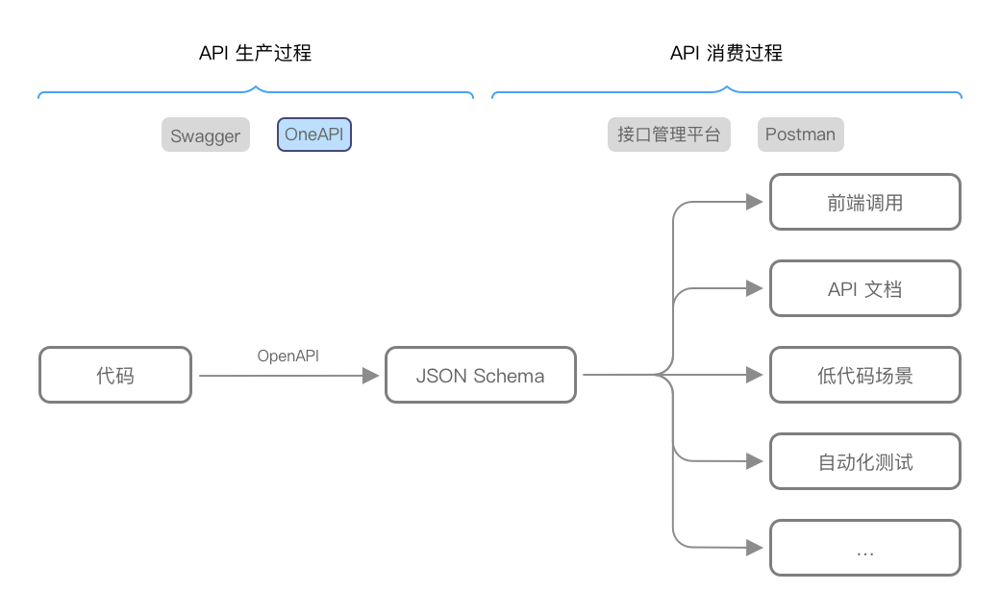
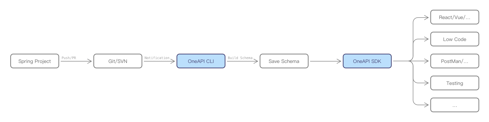

## 关于名字

OneAPI 的名字由 One、API 2 个单词组合而来，寓意为最后一个 API 解决方案 😎

## OneAPI 是什么

OneAPI 是一个能 💯 替代 springdoc-openapi/Swagger 的 API 生产工具，既不需要修改后端代码，也不需要启动应用。 也支持导出 OpenAPI 3.0 协议数据，方便在其他工具中消费（如接口管理平台/Postman 等）。

## 与业界其它产品的差异

如图所示，在 API 生命周期中 OneAPI 的定位是 API 生产，与业界的接口管理平台或 Postman 等工具处于不同阶段。

## 与 Swagger 的区别

OneAPI 早期版本中底层实现也曾基于 Swagger，当我们在支付宝后端推广时遇到几个比较大的问题：

- 接入成本
  - 需要引入 JAR 包，后端出于安全等原因无法接入
  - 后端接入 JAR 包遇到问题时，找不到熟悉 Swagger 的人协助解决
- 使用成本
  - 由于 Swagger 是运行时从上下文中获取 API 信息，需要保证后端服务持续可用
  - 需要额外通过 Java 注解补充 API 描述信息，某些特殊功能需要熟悉 Java 的同学来写 Swagger 插件

OneAPI 当前版本基于 AST 实现，**相比 Swagger 有以下优势**：

- 后端 0 接入成本
  - 核心解析逻辑由 Node 实现，前端可控
  - 具备基础 Java 知识（用于安装 Java/Maven 环境）的前端即可自主完成接入
- 注释即文档（也支持 Swagger 注解方式增加的注释），不需要改动后端代码
- 可扩展，除了 HTTP 协议，也能扩展识别其他 RPC 协议

## 最佳实践

目前探索出基于 OneAPI 的 API 生产/消费最佳实践流程如下：

