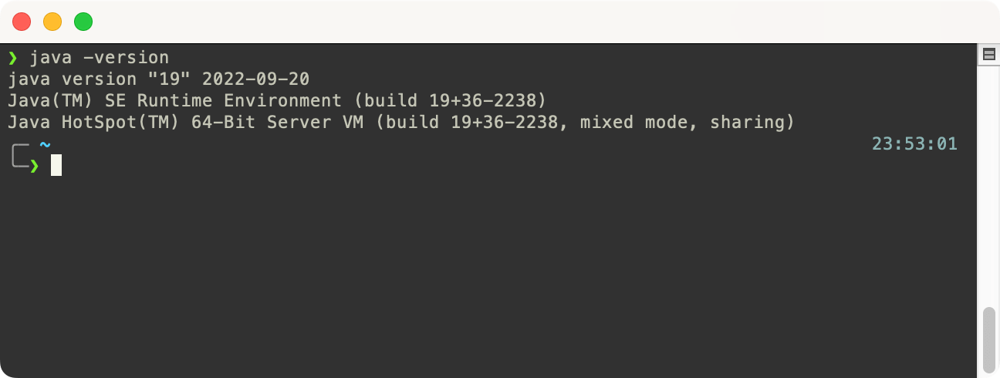
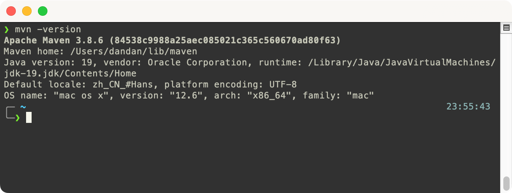

## 安装 Java 环境

<Alert type="info">
若终端中输入 java -version 能正常打印版本，请跳过此章节
</Alert>

[Oracle JDK 下载地址](https://www.oracle.com/java/technologies/downloads)

OneAPI 使用 Java 解析 .java 源文件及反编译 JAR 包解析三方包的中用到的类型信息，因此需要确保机器上有 Java 环境。

安装完成后在终端执行 `java -version` 能正常打印版本表示安装成功。



## 安装 Maven 环境

<Alert type="info">
若终端中输入 mvn -version 能正常打印版本，请跳过此章节
</Alert>

[Maven 下载地址](https://maven.apache.org/download.cgi)

Maven 官方提供的是压缩包，下载完请按 [官方文档](https://maven.apache.org/install.html) 解压安装。

终端中执行 `mvn -version` 若正常打印版本表示安装成功。接下来，请找后端同学复制一份 [settings.xml](https://maven.apache.org/settings.html) 到 `${user.home}/.m2/settings.xml`（可覆盖原文件），避免从官方 Maven 仓库下载依赖时下载不到公司内部的二方 JAR（下载失败会导致接口类型信息缺失）。



## 安装 OneAPI CLI

```
# 请自行切换 cnpm/yarn/pnpm
npm install -g oneapi-cli
```

## CLI 命令

> 可以在 [CodeSandBox](https://codesandbox.io/s/oneapi-services-demo-ktyw7i?file=/src/demo/oneapi.json) 查看开源项目 [macrozheng/mall](https://github.com/macrozheng/mall) 在以下调用示例中的执行结果

### `oneapi analysis`

说明：从 Java 项目解析出 [OneAPI JSON Schema](https://github.com/tudou527/OneAPI/blob/master/typings/javaMeta.d.ts)，参数：

- `-p` 必须，后端项目路径
- `-o` 必须，解析结果保存目录

以 [macrozheng/mall](https://codesandbox.io/s/oneapi-services-demo-ktyw7i?file=/src/demo/oneapi.json) 为例，调用示例：

```
# 解析 mall 目录下的的所有 Java 代码，保存解析结果到 demo 目录(文件名为 oneapi.json)
oneapi analysis -p /Users/admin/workspace/mall -o /Users/admin/demo
```

### `oneapi service`

说明：从 analysis 解析结果生成供前端消费的 service 代码，参数：

- `-s` 必须，analysis 输出的 oneapi.json 文件路径
- `-r` 必须，request 导入字符串（service 方法中导入的 request）
- `-o` 必须，servies 输出目录（目录下的文件在执行过程中会被清空）

以 [macrozheng/mall](https://codesandbox.io/s/oneapi-services-demo-ktyw7i?file=/src/services/demoController.ts) 为例，调用示例：

```
# 在 src 目录下生成前端 service
oneapi service -s /Users/admin/demo/oneapi.json -r 'import request from "@/utils/request";' -o /Users/admin/src
```

### `oneapi openapi`

说明：把 analysis 解析结果转换为 OpeAPI 3.0 JSON Schema 文件（可导入到其他工具消费）

- `-s` 必须，analysis 输出的 oneapi.json 文件路径
- `-o` 必须，OpenAPI JSON Schema 输出目录

以 [macrozheng/mall](https://codesandbox.io/s/oneapi-services-demo-ktyw7i?file=/src/demo/openapi.json) 为例，调用示例：

```
# 把解析结果转换为 OpenAPI 3.0 JSON Schema
oneapi openapi -s /Users/admin/demo/oneapi.json -o /Users/admin/demo
```
